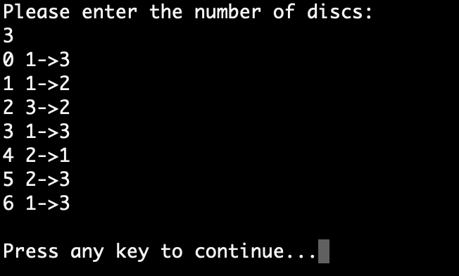

# Tower of Hanoi

## Instructions
This is a game for the Console simulating the moves needed to solve the game Tower of Hanoi.

Open the program in Visual Studio and click play. You are asked to the number of discs and then you are presented with the moves needed to solve the game.

Below description of the game is from wikipedia (https://en.wikipedia.org/wiki/Tower_of_Hanoi)
The Tower of Hanoi is a mathematical game or puzzle. It consists of three rods and a number of disks of different sizes, which can slide onto any rod. The puzzle starts with the disks in a neat stack in ascending order of size on one rod, the smallest at the top, thus making a conical shape.

The objective of the puzzle is to move the entire stack to another rod, obeying the following simple rules:

-Only one disk can be moved at a time.
-Each move consists of taking the upper disk from one of the stacks and placing it on top of another stack or on an empty rod.
-No larger disk may be placed on top of a smaller disk.

With 3 disks, the puzzle can be solved in 7 moves. The minimal number of moves required to solve a Tower of Hanoi puzzle is 2n − 1, where n is the number of disks.

## Screenshots

Image of a physical game (screenshot from Wikipedia)

Here are two example screenshots with the result of the game, where 3 and 5 discs was entered.

## Built with
The project is built in Visual Studio, as a .NET Console Project, with C# as programming language

## Author
* Albert Stjärne (https://github.com/AlbertStjarne)
